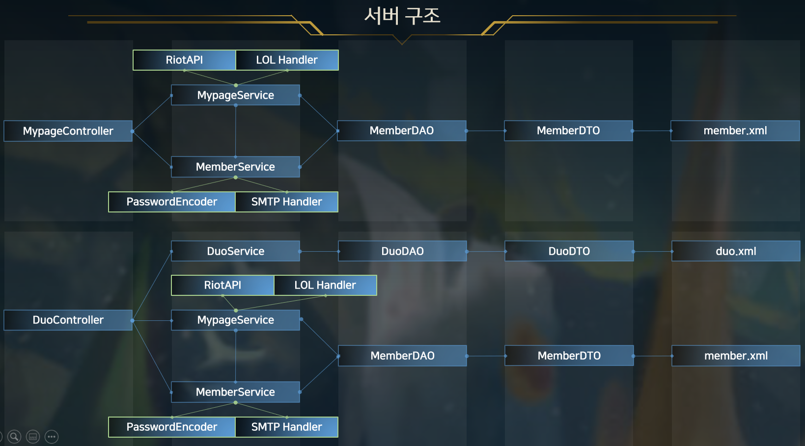

# Introduction to LOLPAN.DOG

## What is LOLPAN.DOG?
- LOL은 AOS장르에 해당하여 5명의 플레이어가 한팀으로 진행됨
- 필연적으로 많은 사람과 의견이 부딪히는 상황이 발생
- 궁극적으로 게임에서 승리하거나 실력 향상을 위해서는 플레이어간 분쟁해결 능력이 요구
- LOLPAN.DOG은 플레이어간 분쟁을 자유로운 피드백 행위를 통해 다양한 의견 공유로 해결
- 궁극적으로 개별 플레이어의 게임 승리 및 멘탈 케어에 기여

 

## Backgrounds
- 최근 MZ세대를 중심으로 LOL 실력향상을 위한 피드백 요청이 급증하고 있음
- 현재 피드백 시장은 특정 유튜버들에 의해 이루어지고 있고, 여타 커뮤니티를 기반하여 진행되고 있지 않음
- 플랫폼 형태로 피드백 시장을 활성화하여, 피드백 시장의 수요와 공급의 균형을 달성
- 플레이어들의 니즈를 파악하여 해당 서비스를 제공하는 웹사이트를 제공함에 따라 큰 시장을 점유할 수 있음

||||
|---|---|---|

- 2016년 기준 월 플레이어수 1억명 이상을 달성
  - 2019년 8월 기준 하루 전세계 서버의 피크 시간 동시 접속자 수를 합치면 800만명 이상
- 전세계 e스포츠 대회 중 가장 많은 시청자수 기록을 보유중
  - 리그오브레전드 월드 챔피언십(2021, 최고 동시 시청자 7386만742명)
- 2022년 3월 15일 기준 국내 게임 점유율 189주 연속 1위
  - 45.55%로 2위 게임인 서든어택 7.96%에 비해 37.59%p 차이

 

# Demo
 

 
 

# Function Architecture

 <b>메인, 회원, 마이페이지, 관리자</b> 

 

 <b>자유게시판, 듀오매칭</b> 

 

 <b>피드백 게시판</b> 

 
 

# Class Architecture

 <b>메인페이지, 멤버</b> 

 

 <b>자유게시판, 피드백</b> 

 

 <b>마이페이지, 듀오매칭</b> 

 

 <b>화면구조</b> 

 
 

# Database Schema

 <b>회원</b> 

 

 <b>듀오매칭</b> 

 

 <b>자유게시판</b> 

|||
|---|---|

 

 <b>피드백</b> 

|||
|---|---|

 
 

# Team & Contribution

 <b>강경필(PL)</b> 

* 메인 페이지 전체(F, B) / 마이 페이지 전체(F, B) / 듀오 매칭 전체(B)
* 로그인/회원가입 – 카카오 연동, SMTP(주, B)
* 피드백게시판, 자유게시판 – 입력 유효성 검사(주, F)
* 웹 페이지 전체 CSS 및 디자인 통합(보조, F)

 

 <b>박진석</b> 

* 자유게시판 전체(B)
* 피드백 게시판 전체(B)
* 자유게시판 전체(보조, F)
* 피드백 게시판 전체(보조, F)

 

 <b>신명환</b> 

* 듀오매칭 전체(F), 듀오매칭 DAO, Mapper(보조, B)
* 정적 이미지 구현(보조)

 

 <b>이상훈</b> 

* 자유게시판 전체(주, F) / 피드백게시판 전체(주, F)
* 웹페이지 전체 CSS 및 디자인 통합(주, F)
* 정적 이미지 구현(주)

 

 <b>임종우</b> 
 

* 로그인/회원가입 전체(F, B)
* 로그인/회원가입 – 카카오 연동, SMTP(보조, B)
* 피드백게시판, 자유게시판 – 입력 유효성 검사(보조, F)

 
 

# Skill & Tools

 <b>Back-end</b> 

* JAVA SE-11
* Spring Boot
* Spring MVC
* Spring Security
* Tomcat

 

 <b>Front-end</b> 

* HTML5
* CSS
* JavaScript
* jQuery
* BootStrap5

 

 <b>DBMS</b> 

* MySQL

 

 <b>DevOps</b> 

* Git/GitHub
* Naver Works

 

 <b>API & Library</b> 

* Naver API - CAPTCHA
* Kakao API - Login
* Riot API - Summoner-V4
* Riot API - Champion-Mastery-V4
* Riot API - League-V4
* Google SMTP
* Toast UI Editor  
  

 
